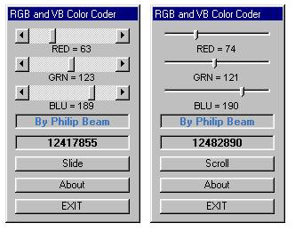



## A RGB & VB Color Coder

### Description

RGB and VB color coder has 3 ways of picking colors (scrollbars, slider bars, and common dialog colors). After picking a color it shows the RGB color code, the VB color code, and the color example... Not hard...
 
### More Info
 

             |
---                |---
**Submitted On**   |2000-07-19 20:49:50
**By**             |[Philip Beam](https://github.com/Planet-Source-Code/PSCIndex/blob/master/ByAuthor/philip-beam.md)
**Level**          |Beginner
**User Rating**    |4.0 (16 globes from 4 users)
**Compatibility**  |VB 3\.0, VB 4\.0 \(16\-bit\), VB 4\.0 \(32\-bit\), VB 5\.0, VB 6\.0, VB Script, ASP \(Active Server Pages\) 
**Category**       |[Miscellaneous](https://github.com/Planet-Source-Code/PSCIndex/blob/master/ByCategory/miscellaneous__1-1.md)
**World**          |[Visual Basic](https://github.com/Planet-Source-Code/PSCIndex/blob/master/ByWorld/visual-basic.md)
**Archive File**   |[CODE\_UPLOAD79427202000\.zip](https://github.com/Planet-Source-Code/philip-beam-a-rgb-vb-color-coder__1-9900/archive/master.zip)

